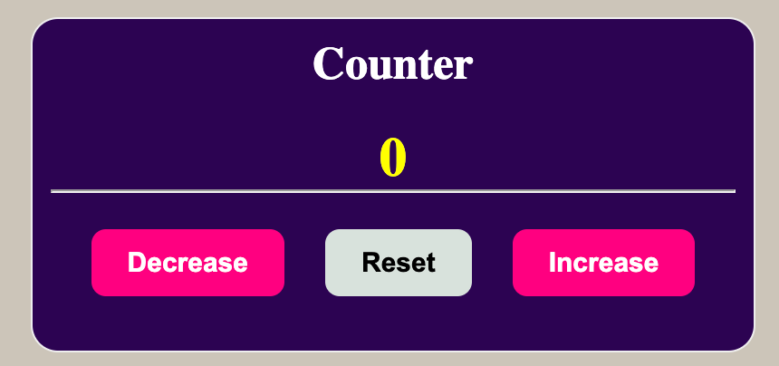

##Counter
<p>
Counter che aggiunge e toglie 1 
</p>


##### Strumenti utilizzati:

- HTML
- CSS
-  JavaScript

#### Comandi 

<ul>
<u> Increase</u> : mi permette di aumentare  di 1
<u>Decrease</u> : mi permette di diminuire di 1
<u>Reset</u> : resetta tutto a 0
</ul>
<br>

```
 <button class="decrease">Decrease</button>
 <button class="reset">Reset</button>
 <button class="increase">Increase</button>
```
<br>

##### Risultato finale


